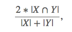

# Ultrasound-Nerve-Segmentation
A prediction model that can identify nerve structures in a dataset of ultrasound images of the human neck.

### The data:
The image set is pretty large (over 1gb), so I'm not going to host it here. Instead please grab it from the original source on Kaggle:
https://www.kaggle.com/c/ultrasound-nerve-segmentation/data

This question and data are all thanks to a [Kaggle competition](https://www.kaggle.com/c/ultrasound-nerve-segmentation), thanks go to them for an inspiring problem and to the helpful competitors' posts on the [forum](https://www.kaggle.com/c/ultrasound-nerve-segmentation/forums)

* The highlighted regions of each image are [run-length encoded](http://www.stoimen.com/blog/2012/01/09/computer-algorithms-data-compression-with-run-length-encoding/)
* 5635 observations in the training set. Each observation is one image.
* 3 features (p=3): subject, img, pixels
* Response: the pixels that make up the area of the BP region in the ultrasound image, if any is found.
* Unsure: Classification problem since response is categorical

### The questions:
1. What is the question you hope to answer?
Can we identify a specific nerve structure ([Brachial Plexus](https://en.wikipedia.org/wiki/Brachial_plexus)) in [ultrasound images](https://en.wikipedia.org/wiki/Medical_ultrasound) of the human neck?

2. What data are you planning to use to answer that question?
Training images with the desired region of the neck manually highlighted (if present at all).

3. What do you know about the data so far?
	* The images are pretty noisy
	* Not every ultrasound image contains the Brachial Plexus
 

#### Why I think it's a worthwhile project:
The easy answer is: I'm studying and working in healthcare! It's a fitting topic given my field. The truer answer is: I think tech and data is the best way that I personally can help influence people's health for the better.
 

#### Why Kaggle thinks it's a worthwhile project:
"Even the bravest patient cringes at the mention of a surgical procedure. Surgery inevitably brings discomfort, and oftentimes involves significant post-surgical pain. Currently, patient pain is frequently managed through the use of narcotics that bring a bevy of unwanted side effects.

Accurately identifying nerve structures in ultrasound images is a critical step in effectively inserting a patient’s pain management catheter... Doing so would improve catheter placement and contribute to a more pain free future."

#### Evaluation

This competition is evaluated on the mean Dice coefficient. The Dice coefficient can be used to compare the pixel-wise agreement between a predicted segmentation and its corresponding ground truth. The formula is given by:

where X is the predicted set of pixels and Y is the ground truth. The Dice coefficient is defined to be 1 when both X and Y are empty. The leaderboard score is the mean of the Dice coefficients for each image in the test set.

#### Submission
In order to reduce the submission file size, our metric uses run-length encoding on the pixel values.  Instead of submitting an exhaustive list of indices for your segmentation, you will submit pairs of values that contain a start position and a run length. E.g. '1 3' implies starting at pixel 1 and running a total of 3 pixels (1,2,3).

The competition format requires a space delimited list of pairs. For example, '1 3 10 5' implies pixels 1,2,3,10,11,12,13,14 are to be included in the mask. The metric checks that the pairs are sorted, positive, and the decoded pixel values are not duplicated. The pixels are numbered from top to bottom, then left to right: 1 is pixel (1,1), 2 is pixel (2,1), etc.
